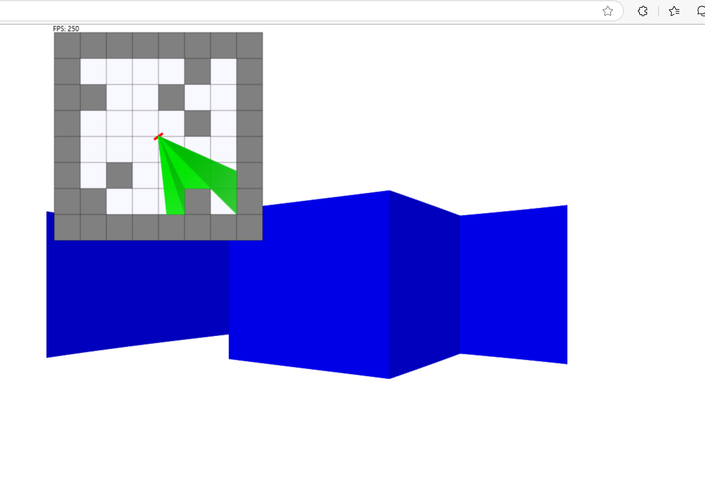

# Raycast

A simple repo for learning raycast.

## Build

```bash
1. npm install
2. npx tsc
```

Open index.html in the browser, or start an HTTP server to serve it.

## Demo



## What's the next (Maybe)?

1. Change to DDA algorithm for collision detection.
2. Render the texture of objects.
